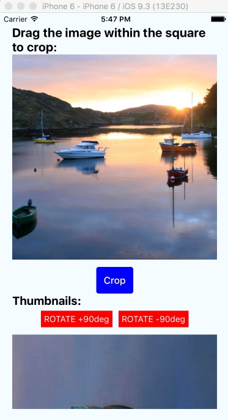

# RNImageTest
Simple React-Native App for crop and rotate image

Get imege and displaing in ScrollView

User can resize and move image in cropping area.
After press on button "Crop" create thumbnail and display under the button in block "Thumbnails"
At the top of each picture two buttons for rotate image (this part have issue with native rotate for fiture seving image. Now image rotatin with CSS Transform property )
